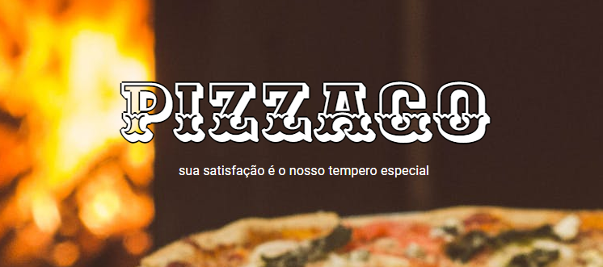
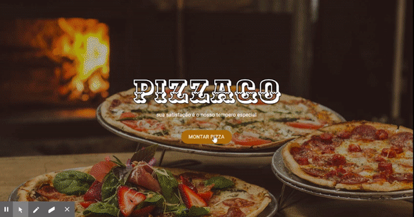

## Mount your own pizza! 🏗

## Select recommendation to earn benefit points! ✨

----

## MENSAGEM IMPORTANTE
### Essa mensagem é direcionada a quem estiver analisando esse código

Olá, o código do Pizzago foi escrito com muito carinho e cuidado para manter a legibilidade e a facilidade de manutenção. Existem algumas optimizações que gostaria de ter feito, mas que por conta do meu tempo, não pude implementar. São elas:

- Separar as funções de criação de Cards em um componente específico, já que ele se repete dentro de outros componentes

- Separar os títulos em um componente específico, pois os títulos também se repetem em alguns componentes

Essas optimizações já foram implementadas na minha máquina, mas não vou subir para o repositório agora para não desrespeitar o prazo estipulado de entrega do código. Obrigado ^^

---
## Description 📝
PIZZAGO is a pizza service that allows the user to select their pizza in a customized way and even offers benefit points if they select day recommendation!

----
## technologies 🚀

### Frontend 📸
- React
- Material-ui
- React-router-dom
- Axios

### Backend 🔧
- Axios
- Express
- Nodemon
- CORS
- JSON-Server
